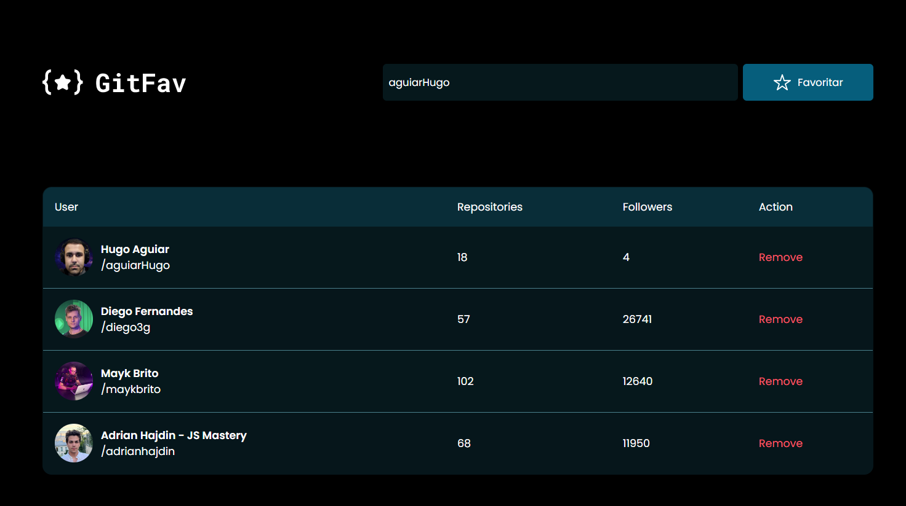

<h1 align="center"> GitFav</h1>

  <a href="#-tecnologias">Tecnologias</a>

 

    

## 🚀 Tecnologias

Esse projeto foi desenvolvido com as seguintes tecnologias:

- HTML e CSS
- JavaScript
- Git e Github

## 💻 Projeto

Projeto desenvolvido durante o programa Explrorer da Rocketseat.

Tem como objetivo criar uma página onde podemos favoritar os nossos usuários preferidos do Github.